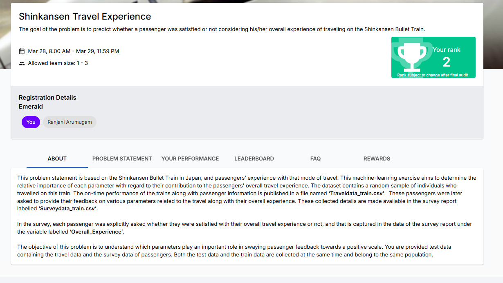

# 🚄 Shinkansen Travel Experience Prediction

## 🥈 2nd Place — Institute Data Science Hackathon

Machine learning solution developed for an institute-level Data Science hackathon to predict whether a passenger was satisfied with their overall Shinkansen travel experience.



> **Hackathon result:** 2nd place  
> **Recorded validation accuracy:** 95.82%

---

## 📌 Problem Statement

The challenge provides two related datasets:

- **Travel Data** — passenger and journey information
- **Survey Data** — passenger feedback about the travel experience

The two datasets are joined using `ID`.

The target variable is:

- `Overall_Experience = 1` → Satisfied
- `Overall_Experience = 0` → Not Satisfied

The objective is to predict the overall experience of passengers in the test dataset.

---

## 🧠 Approach

### 1. Data Preparation
- Loaded Travel and Survey datasets
- Merged the datasets using passenger `ID`
- Inspected data types and missing values
- Created a stratified train/validation split

### 2. Feature Engineering
Created additional features to capture journey disruption and passenger characteristics:

- `Total_Delay`
- `Delay_per_km`
- `Age_group`

### 3. Machine Learning Models

Two tree-based models were used:

- **CatBoost Classifier**
- **XGBoost Classifier**

CatBoost was used with categorical variables directly, while categorical features were one-hot encoded for XGBoost.

### 4. Ensemble Modeling

The final approach blended the probability predictions from CatBoost and XGBoost:

```text
Blended Probability =
    w × CatBoost Probability
    + (1 - w) × XGBoost Probability
```

The blend weight and classification threshold were searched on the validation set.

The original hackathon solution found:

- **Best weight:** 0.45
- **Best threshold:** 0.49
- **Validation accuracy:** 95.82%

### 5. Final Prediction

For additional stability, the final notebook trains CatBoost and XGBoost using two random seeds and averages their test-set probabilities before applying the selected ensemble weight and threshold.

---

## 🏆 Hackathon Achievement

**Rank: 2nd Place**

This project was completed as part of an institute-conducted Data Science hackathon with a team size of 1–3 participants.

The displayed competition result is based on the hackathon platform's recorded ranking.

---

## 🛠️ Tech Stack

- Python
- Pandas
- NumPy
- Scikit-learn
- CatBoost
- XGBoost
- Joblib
- Jupyter Notebook

---

## 📊 Dataset

The competition supplied four files:

```text
Traveldata_train_(1).csv
Surveydata_train_(1).csv
Traveldata_test_(1).csv
Surveydata_test_(1).csv
```

The datasets are not included in this repository unless redistribution is permitted by the competition organizers.

To reproduce the project locally, download the files from the original hackathon platform and place them in:

```text
data/
```

See `data/README.md` for the expected filenames.

---

## 📁 Repository Structure

```text
Shinkansen-Travel-Experience/
│
├── README.md
├── Shinkansen_Travel_Experience.ipynb
│
├── data/
│   └── README.md
│
├── images/
│   └── hackathon_rank.png
│
└── submission/
    └── README.md
```

---

## 🔍 Key Takeaways

- Combining travel and survey information creates a richer passenger-level dataset.
- Delay-related feature engineering adds information beyond the raw delay fields.
- CatBoost handles the project's large number of categorical survey variables effectively.
- XGBoost provides a complementary gradient-boosting model.
- Ensemble weight and threshold optimization improved the validation result during the hackathon.
- The project demonstrates practical experience with feature engineering, categorical data handling, ensemble modeling, and competition-oriented model optimization.

---

## 🚀 Future Improvements

- Cross-validation for more robust model selection
- SHAP-based model interpretation
- Probability calibration
- More systematic ensemble optimization
- Experiment tracking
- Deployment as an interactive prediction application

---
